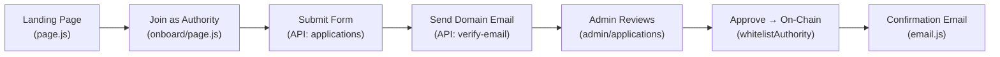
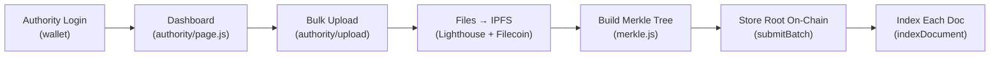
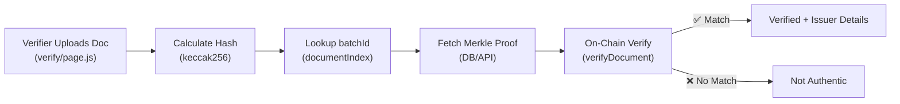
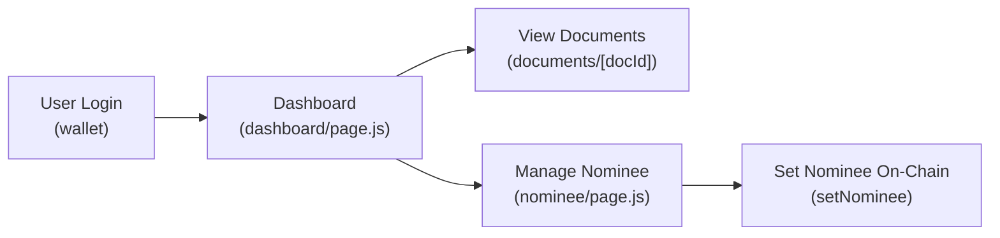
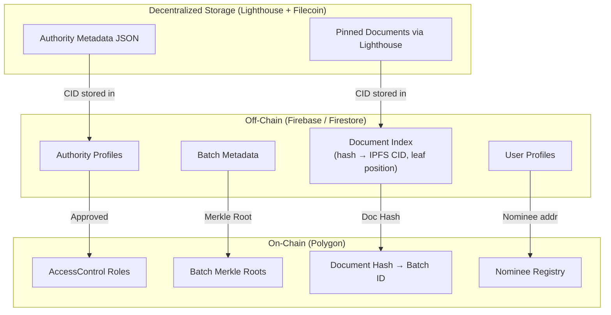

# TrueStamp — Project Architecture & Structure

> Blockchain-powered document verification platform on Polygon. Built for the LNCT Buildverse Hackathon.

## Tech Stack

| Layer | Technology | Purpose |
|-------|-----------|---------|
| **Frontend** | Next.js 14 (App Router) + TailwindCSS | SSR, routing, responsive UI |
| **Wallet** | RainbowKit + wagmi + viem | Wallet connection, contract interaction |
| **Smart Contracts** | Solidity ^0.8.20 + Hardhat | Role management, Merkle root storage |
| **Storage** | IPFS (Lighthouse + Filecoin) | Off-chain document storage + long-term archival |
| **Hashing** | Merkle Trees (merkletreejs + keccak256) | Gas-efficient batch verification |
| **Email** | Resend / Nodemailer | Domain verification, notifications |
| **Database** | Firebase (Firestore + Auth) | Off-chain metadata, user profiles, application queue |
| **Chain** | Polygon Amoy Testnet → Polygon PoS | Low gas fees, EVM compatible |

---

## Directory Structure

```
truestamp/
├── contracts/                          # Solidity smart contracts
│   ├── TrueStamp.sol                   # Main contract (roles, Merkle roots, nominee)
│   ├── interfaces/
│   │   └── ITrueStamp.sol              # Contract interface
│   └── libraries/
│       └── MerkleVerifier.sol          # On-chain Merkle proof verification
│
├── scripts/                            # Hardhat deployment & interaction scripts
│   ├── deploy.js                       # Deploy TrueStamp contract
│   └── seed.js                         # Seed test data (dev only)
│
├── test/                               # Smart contract tests
│   ├── TrueStamp.test.js
│   └── MerkleVerifier.test.js
│
├── hardhat.config.js                   # Hardhat config (Polygon Amoy)
│
├── src/                                # Next.js App Router
│   ├── app/
│   │   ├── layout.js                   # Root layout (providers, navbar, footer)
│   │   ├── page.js                     # Landing page (hero, features, CTA)
│   │   ├── globals.css                 # Tailwind base + custom styles
│   │   │
│   │   ├── onboard/                    # ── Phase 1: Authority Onboarding ──
│   │   │   ├── page.js                 # "Join as Authority" application form
│   │   │   └── verify/
│   │   │       └── page.js             # Email domain verification status
│   │   │
│   │   ├── admin/                      # ── Phase 1: Admin Approval Layer ──
│   │   │   ├── page.js                 # Admin dashboard (pending applications)
│   │   │   ├── applications/
│   │   │   │   └── [id]/
│   │   │   │       └── page.js         # Review single application + approve/reject
│   │   │   └── authorities/
│   │   │       └── page.js             # List of whitelisted authorities
│   │   │
│   │   ├── authority/                  # ── Phase 2: Document Issuance ──
│   │   │   ├── page.js                 # Authority dashboard (stats, history)
│   │   │   ├── upload/
│   │   │   │   └── page.js             # Bulk document upload interface
│   │   │   └── batches/
│   │   │       ├── page.js             # Upload batch history
│   │   │       └── [batchId]/
│   │   │           └── page.js         # Single batch details + documents
│   │   │
│   │   ├── verify/                     # ── Phase 3: Instant Authentication ──
│   │   │   └── page.js                 # Public verification portal (drag & drop)
│   │   │
│   │   ├── dashboard/                  # ── Phase 4: User/Holder Layer ──
│   │   │   ├── page.js                 # User dashboard (all issued documents)
│   │   │   ├── documents/
│   │   │   │   └── [docId]/
│   │   │   │       └── page.js         # Single document detail + share
│   │   │   └── nominee/
│   │   │       └── page.js             # Nominee management (add/remove/extend)
│   │   │
│   │   └── api/                        # Next.js API Routes (backend logic)
│   │       ├── auth/
│   │       │   └── verify-email/
│   │       │       └── route.js        # Domain email verification endpoint
│   │       ├── admin/
│   │       │   ├── applications/
│   │       │   │   └── route.js        # GET pending apps, POST approve/reject
│   │       │   └── whitelist/
│   │       │       └── route.js        # Trigger on-chain whitelisting tx
│   │       ├── authority/
│   │       │   ├── upload/
│   │       │   │   └── route.js        # Handle bulk upload → IPFS → Merkle tree
│   │       │   └── batches/
│   │       │       └── route.js        # GET batch history
│   │       ├── verify/
│   │       │   └── route.js            # Hash uploaded doc → check Merkle proof
│   │       ├── user/
│   │       │   ├── documents/
│   │       │   │   └── route.js        # GET user's documents
│   │       │   └── nominee/
│   │       │       └── route.js        # POST set/update nominee
│   │       └── ipfs/
│   │           └── route.js            # Upload/fetch from IPFS (Lighthouse + Filecoin)
│   │
│   ├── components/
│   │   ├── layout/
│   │   │   ├── Navbar.jsx              # Wallet connect + role-based nav
│   │   │   ├── Footer.jsx
│   │   │   └── Sidebar.jsx             # Dashboard sidebar (authority/admin/user)
│   │   ├── landing/
│   │   │   ├── Hero.jsx                # Animated hero with CTA
│   │   │   ├── Features.jsx            # Feature cards (4 phases)
│   │   │   ├── HowItWorks.jsx          # Step-by-step flow diagram
│   │   │   └── TrustBanner.jsx         # "Powered by Polygon" trust signals
│   │   ├── onboard/
│   │   │   ├── ApplicationForm.jsx     # Multi-step authority application
│   │   │   └── WalletSetup.jsx         # Guide for new Web3 users
│   │   ├── admin/
│   │   │   ├── ApplicationCard.jsx     # Single application review card
│   │   │   └── ApprovalModal.jsx       # Confirm on-chain whitelist modal
│   │   ├── authority/
│   │   │   ├── BulkUploader.jsx        # Drag & drop + progress bar
│   │   │   ├── BatchCard.jsx           # Batch summary card
│   │   │   └── UploadStats.jsx         # Dashboard statistics
│   │   ├── verify/
│   │   │   ├── DropZone.jsx            # Document upload for verification
│   │   │   ├── VerificationResult.jsx  # ✅ Verified / ❌ Not Found display
│   │   │   └── IssuerDetails.jsx       # Show issuer info on success
│   │   ├── dashboard/
│   │   │   ├── DocumentCard.jsx        # Single document card
│   │   │   ├── NomineeForm.jsx         # Add/edit nominee
│   │   │   └── DocumentViewer.jsx      # View document from IPFS
│   │   └── shared/
│   │       ├── WalletButton.jsx        # Connect/disconnect wallet
│   │       ├── RoleGuard.jsx           # Protect routes by role (admin/issuer/user)
│   │       ├── StatusBadge.jsx         # Pending/Approved/Rejected badge
│   │       ├── LoadingSpinner.jsx
│   │       ├── Toast.jsx               # Notification toasts
│   │       └── TransactionStatus.jsx   # On-chain tx pending/confirmed UI
│   │
│   ├── hooks/
│   │   ├── useContract.js              # TrueStamp contract instance
│   │   ├── useRole.js                  # Check current wallet's role
│   │   ├── useMerkleTree.js            # Build & verify Merkle proofs client-side
│   │   ├── useIPFS.js                  # Upload/fetch from IPFS via Lighthouse
│   │   └── useDocuments.js             # Fetch user's documents
│   │
│   ├── lib/
│   │   ├── contract.js                 # ABI + contract address config
│   │   ├── merkle.js                   # Merkle tree utilities (build, getProof)
│   │   ├── lighthouse.js               # Lighthouse SDK + Filecoin client
│   │   ├── firebase.js                 # Firebase Admin SDK / Firestore init
│   │   ├── email.js                    # Email sending utility
│   │   └── constants.js                # Contract addresses, chain IDs, roles
│   │
│   ├── collections/                    # Firestore collection schemas (off-chain data)
│   │   ├── authorities.js              # Organization profile + status
│   │   ├── batches.js                  # Upload batch (Merkle root, IPFS CIDs)
│   │   ├── documents.js               # Individual doc metadata + leaf hash
│   │   └── users.js                    # Wallet address → documents mapping
│   │
│   └── providers/
│       ├── Web3Provider.jsx            # RainbowKit + wagmi config
│       └── ThemeProvider.jsx           # Dark/light mode
│
├── public/
│   ├── logo.svg
│   ├── og-image.png                    # Social preview image
│   └── icons/                          # Phase icons, verification icons
│
├── .env.local                          # API keys (Lighthouse, Alchemy, Firebase, Resend)
├── tailwind.config.js
├── next.config.js
├── package.json
└── README.md
```

---

## Smart Contract Architecture

### `TrueStamp.sol` — Core Contract

```
┌──────────────────────────────────────────────────────────────────┐
│                        TrueStamp.sol                             │
├──────────────────────────────────────────────────────────────────┤
│                                                                  │
│  Roles (AccessControl)                                           │
│  ├── DEFAULT_ADMIN_ROLE  → TrueStamp team (deploy wallet)       │
│  ├── ISSUER_ROLE         → Approved authority wallets            │
│  └── (any wallet)        → Public verifier / document holder     │
│                                                                  │
│  Structs                                                         │
│  ├── AuthorityInfo { name, department, ipfsMetadataCID, ts }     │
│  ├── Batch { merkleRoot, ipfsCID, issuer, docCount, ts }         │
│  └── Nominee { nomineeAddr, expiryTimestamp, isActive }          │
│                                                                  │
│  Mappings                                                        │
│  ├── authorities: address → AuthorityInfo                        │
│  ├── batches: batchId → Batch                                   │
│  ├── issuerBatches: address → batchId[]                          │
│  ├── nominees: address → Nominee                                 │
│  └── documentIndex: docHash → batchId                            │
│                                                                  │
│  Functions                                                       │
│  ├── Admin                                                       │
│  │   ├── whitelistAuthority(addr, name, dept, members[])         │
│  │   └── revokeAuthority(addr)                                   │
│  ├── Issuer                                                      │
│  │   ├── submitBatch(merkleRoot, ipfsCID, docCount)              │
│  │   └── indexDocument(docHash, batchId)                         │
│  ├── Verifier (Public)                                           │
│  │   ├── verifyDocument(docHash, merkleProof, batchId) → bool    │
│  │   └── getBatchInfo(batchId) → Batch                           │
│  ├── Holder                                                      │
│  │   ├── setNominee(nomineeAddr, durationMonths)                 │
│  │   ├── removeNominee()                                         │
│  │   └── claimAsNominee(originalOwner) [after expiry check]      │
│  └── Events                                                      │
│      ├── AuthorityWhitelisted(addr, name)                        │
│      ├── BatchSubmitted(batchId, issuer, merkleRoot)             │
│      ├── DocumentVerified(docHash, batchId, verifier)            │
│      └── NomineeSet(owner, nominee, expiry)                      │
│                                                                  │
└──────────────────────────────────────────────────────────────────┘
```

---

## Phase-to-Code Mapping

### Phase 1: Authority Onboarding & Trust Setup



| Step | Frontend | API Route | Contract | DB Model |
|------|----------|-----------|----------|----------|
| Wallet setup | `WalletSetup.jsx` | — | — | — |
| Application form | `ApplicationForm.jsx` | `POST /api/admin/applications` | — | `Authority` |
| Email verification | `onboard/verify/page.js` | `POST /api/auth/verify-email` | — | `Authority.emailVerified` |
| Admin approval | `admin/applications/[id]` | `POST /api/admin/whitelist` | `whitelistAuthority()` | `Authority.status` |
| Confirmation | — | Uses `email.js` | Event: `AuthorityWhitelisted` | — |

---

### Phase 2: Document Issuance



| Step | Frontend | API Route | Contract | DB Model |
|------|----------|-----------|----------|----------|
| Dashboard | `authority/page.js` | `GET /api/authority/batches` | — | `Batch` |
| Bulk upload | `BulkUploader.jsx` | `POST /api/authority/upload` | — | — |
| IPFS storage | — | Uses `lighthouse.js` | — | `Document.ipfsCID` |
| Merkle tree | — | Uses `merkle.js` | — | `Batch.merkleRoot` |
| On-chain batch | — | Triggers via wagmi | `submitBatch()` | `Batch` |
| Doc indexing | — | Loop in API route | `indexDocument()` | `Document` |

---

### Phase 3: Instant Authentication



| Step | Frontend | API Route | Contract | DB Model |
|------|----------|-----------|----------|----------|
| Upload doc | `DropZone.jsx` | `POST /api/verify` | — | — |
| Hash & lookup | — | In API route | `documentIndex` mapping | `Document` |
| Merkle proof | — | `merkle.js: getProof()` | `verifyDocument()` | `Batch` |
| Result display | `VerificationResult.jsx` | — | — | — |

---

### Phase 4: User Control



| Step | Frontend | API Route | Contract | DB Model |
|------|----------|-----------|----------|----------|
| Document list | `DocumentCard.jsx` | `GET /api/user/documents` | — | `Document` |
| View single doc | `DocumentViewer.jsx` | Uses `lighthouse.js` | — | `Document` |
| Set nominee | `NomineeForm.jsx` | `POST /api/user/nominee` | `setNominee()` | `User.nominee` |
| Claim as nominee | — | — | `claimAsNominee()` | — |

---

## Data Flow Diagram



---

## Environment Variables (`.env.local`)

```env
# Blockchain
NEXT_PUBLIC_CONTRACT_ADDRESS=0x...
NEXT_PUBLIC_CHAIN_ID=80002
ALCHEMY_API_KEY=...
DEPLOYER_PRIVATE_KEY=...        # Admin wallet (NEVER expose to frontend)

# Decentralized Storage
LIGHTHOUSE_API_KEY=...

# Firebase
FIREBASE_PROJECT_ID=...
FIREBASE_CLIENT_EMAIL=...
FIREBASE_PRIVATE_KEY=...

# Email
RESEND_API_KEY=...

# App
NEXT_PUBLIC_APP_URL=http://localhost:3000
ADMIN_WALLET_ADDRESS=0x...
```

---

## Key `package.json` Dependencies

```json
{
  "dependencies": {
    "next": "^14.2.0",
    "react": "^18.3.0",
    "react-dom": "^18.3.0",
    "@rainbow-me/rainbowkit": "^2.0.0",
    "wagmi": "^2.5.0",
    "viem": "^2.8.0",
    "@tanstack/react-query": "^5.0.0",
    "merkletreejs": "^0.3.11",
    "keccak256": "^1.0.6",
    "@lighthouse-web3/sdk": "^0.3.0",
    "firebase": "^10.12.0",
    "firebase-admin": "^12.1.0",
    "resend": "^3.2.0",
    "react-dropzone": "^14.2.0",
    "framer-motion": "^11.0.0",
    "lucide-react": "^0.350.0"
  },
  "devDependencies": {
    "hardhat": "^2.22.0",
    "@nomicfoundation/hardhat-toolbox": "^5.0.0",
    "tailwindcss": "^3.4.0",
    "postcss": "^8.4.0",
    "autoprefixer": "^10.4.0"
  }
}
```

---

## Verification Plan

### Automated Tests
- `npx hardhat test` — Smart contract unit tests (role assignment, batch submission, Merkle verification, nominee logic)
- `npm run lint` — ESLint + Next.js lint rules

### Manual Verification
- **Phase 1**: Submit authority application → verify email → admin approves → check on-chain role via PolygonScan
- **Phase 2**: Upload 100 test PDFs → verify IPFS pins → verify Merkle root on-chain → confirm each doc hash resolves to correct batch
- **Phase 3**: Upload known document → instant ✅ result. Upload tampered document → instant ❌ result
- **Phase 4**: Set nominee → verify on-chain. Wait for expiry simulation → nominee claims access

---

## Open Questions

> [!IMPORTANT]
> **Hackathon Demo Scope**: Which phase(s) should be fully functional for the demo? I'd recommend **Phase 2 (Bulk Upload + Merkle) and Phase 3 (Instant Verification)** as the "wow moment" — the admin flow can be simulated with pre-seeded data.

> [!IMPORTANT]
> **Wallet Creation**: You mentioned "create a wallet right there" for new users. Options:
> - **RainbowKit's built-in** — supports MetaMask, Coinbase Wallet, WalletConnect (easiest)
> - **Embedded wallet** (Privy / Web3Auth) — email/social login, no extension needed (better UX for judges)
> Which approach do you prefer?

> [!WARNING]
> **Firebase vs Fully On-Chain**: The current design uses Firebase Firestore for off-chain metadata (application queue, document index, user profiles). This is the pragmatic approach for a hackathon, but judges might ask "why not fully decentralized?". Be ready to explain that only **critical verification data** (Merkle roots, roles) lives on-chain, while **metadata** stays off-chain for speed and cost reasons. Firebase also gives you real-time listeners, easy auth, and zero server management — ideal for hackathon speed.

> [!NOTE]
> **Gas Optimization**: The `indexDocument()` function stores individual doc hashes on-chain. For 10,000 documents, this could be expensive even on Polygon. Alternative: keep the index **only in Firestore** and do client-side Merkle proof verification. The on-chain contract only needs to store Merkle roots. This is a key design tradeoff to decide.
